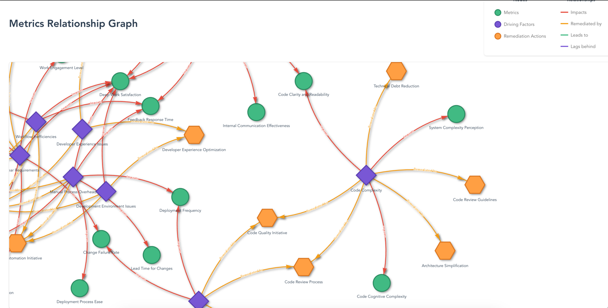

## What is Engineering(Developer) Experience index?
 Engineering (Developer) Experience is a tool designed to help identify trends and guide the implementation of remediation actions when performance metrics decline.

 We recommend starting with four key metrics: Speed, Quality, Impact, and DevEx Score.

 The first three metrics focus primarily on delivery performance, while the DevEx Score reflects organizational culture and serves as a leading indicator for the other metrics.

 A downward trend in your DevEx Score is likely to impact the other metrics over time. It should be interpreted as an early warning signal, prompting discussions with your teams to identify and implement appropriate remediation actions.

## How to use it?

1.	**Start by Collecting Data**:
      Focus on gathering data for the four core metrics: Speed, Quality, Impact, and DevEx Score.
2.	**Begin with Surveys**:
Surveys are the simplest way to start collecting data. You can expand to collecting metrics directly from your systems over time, but keep it simple in the beginning.
•	A list of survey questions for each category is available in the repository. TODO: [Data collection ]()
3.	**Monitor Trends**:
•	Keep an eye on trends. If you notice a decline in any metric, consult the remediation list.
•	Choose actions from the list that are most relevant to your context. Always discuss these steps with your team to avoid solving the wrong problem.

Note: The remediation list provides suggested actions but does not guarantee a solution to your specific issue. Use it as a guide, not a definitive answer.

4. **Periodically update your metric values**:
To keep your data current, update your metrics regularly—our recommendation is to do this quarterly.
*	Use the /metrics/values endpoint to add new metric values. See swagger file for more information. 
*	Upcoming features: Microsoft Forms exporters and CSV upload capabilities will be introduced soon to make this process even easier.

## How to contribute?
This repository is built to support the open-source contribution model.

* 	Add New Items: You can contribute by adding new driving factors, remediation actions, or metrics. Simply create a pull request (PR) in the relevant section.
* [Driving factors](src/main/resources/driving_factors/technical/insufficient_test_coverage.yml)
* [Metrics](src/main/resources/metrics/speed/lead_time_for_changes.yml)
* [Remediation Actions](src/main/resources/remediation_actions/technical/contract_testing.yml)
* Share Your Experiences:
* *	Update existing items with insights from your experience.
* *	Share how these items have impacted your teams.

We look forward to your contributions and experiences to enhance the repository for everyone!

## Screenshots 
See all teams under your departments: 

**4 Core  metrics** 

**Latest metrics for a team** 

**Trends** 

**Metrics**

**Driving Factors and Remediation Actions**

**Metric Graph**
