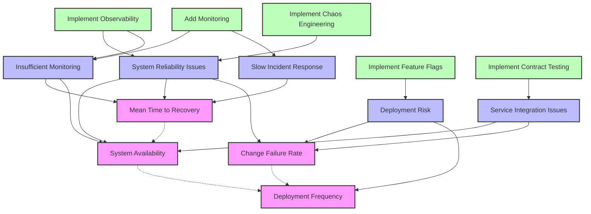
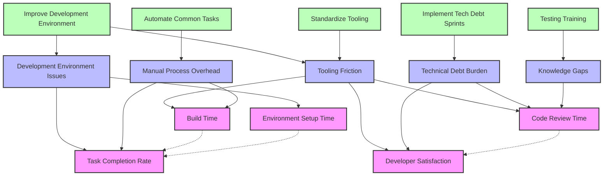
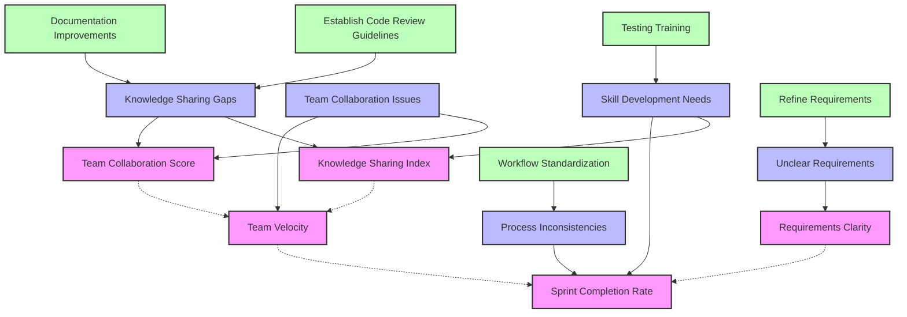

# Metric and Factor Relationships

## System Performance Metrics Flow

## Developer Experience Flow

## Team Effectiveness Flow

## Legend
- Pink boxes: Metrics
- Blue boxes: Driving Factors
- Green boxes: Remediation Actions
- Solid arrows: Direct influence
- Dotted arrows: Metric relationships

## Reading the Graphs
1. **Driving Factors → Metrics**: Solid arrows show which factors affect which metrics
2. **Remediation Actions → Driving Factors**: Solid arrows show which actions address which factors
3. **Metric → Metric**: Dotted arrows show relationships between metrics (leading/lagging) 